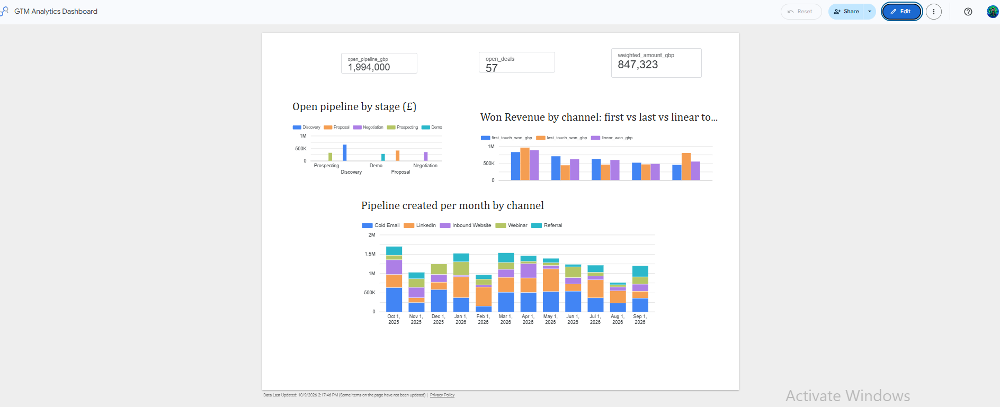

# GTM Analytics Stack

A small, end-to-end GTM data stack: CRM-style data is loaded into a **BigQuery** warehouse, modelled with **dbt**, and reported in **Looker Studio**. It answers the four questions a revenue team asks every week:

| Question | Model |
|---|---|
| Where is our pipeline right now? | `fct_pipeline` |
| How well does each stage convert? | `fct_stage_conversion` |
| Which channels actually create and win pipeline? | `fct_attribution` |
| What will we close this quarter? | `fct_forecast` |
| How is pipeline creation trending? | `fct_pipeline_created` |

> All data is **synthetic**, generated by `scripts/generate_data.py`: 400 B2B SaaS deals selling into financial services, with 1,200+ touches and full stage history.



## Architecture

```
scripts/generate_data.py  ->  seeds/*.csv
                                   |  dbt seed
                                   v
                    BigQuery  raw  (raw_deals, raw_touches, raw_stage_history)
                                   |  dbt run
                                   v
                    staging  (stg_deals, stg_touches, stg_stage_history)   - clean, typed, numbered
                                   |
                                   v
                    marts    (fct_pipeline, fct_stage_conversion,
                              fct_attribution, fct_forecast,
                              fct_pipeline_created)                         - business-ready tables
                                   |
                                   v
                           Looker Studio dashboard
```

## How the models work

**Stage conversion.** For every closed deal, find the furthest stage it reached. For each stage, `win_rate_from_stage` = won deals / closed deals that reached that stage. Only closed deals are used, so open deals don't drag the rates down before they've finished.

**Forecast.** Each open deal is weighted by the historical win rate from its current stage: a £50k deal in Proposal with a 54% win rate counts as £27k. Sum by `expected_close_quarter` to get the quarterly forecast.

**Attribution.** Every deal has 1–5 touches before it was created. Credit is assigned three ways:
- *First touch*: 100% to the channel that started the journey
- *Last touch*: 100% to the final touch before the deal was created
- *Linear*: split equally across all touches

Comparing the three is the point. In this dataset Cold Email sources the most pipeline on first touch, but Referral generates the most **won** revenue under every model. That's the kind of finding that changes where a team spends effort.

**Data quality.** `models/schema.yml` tests unique and non-null IDs, valid stage values, and that every touch and stage record belongs to a real deal.

## Run it yourself

### 1. Set up BigQuery (free, no card)
1. Go to console.cloud.google.com and create a project. The BigQuery **sandbox** is free.
2. Note your project ID.
3. Install the Google Cloud CLI, then run: `gcloud auth application-default login`

### 2. Install dbt
```bash
python -m venv .venv && source .venv/bin/activate     # Windows: .venv\Scripts\activate
pip install dbt-bigquery
```

### 3. Connect dbt to BigQuery
Copy `profiles.yml.example` to `~/.dbt/profiles.yml` and replace `YOUR_GCP_PROJECT_ID`.
```bash
dbt debug          # should end with "All checks passed!"
```

### 4. Generate data, load it, build the models, run the tests
```bash
python scripts/generate_data.py
dbt seed           # loads the CSVs into BigQuery (dataset gtm_raw)
dbt run            # builds staging views and mart tables (gtm_staging, gtm_marts)
dbt test           # runs the data-quality tests
dbt docs generate && dbt docs serve   # optional: lineage graph, good for screenshots
```

### 5. Build the dashboard in Looker Studio
Go to lookerstudio.google.com, then **Create > Report > BigQuery**, and add the `gtm_marts` tables. A single page is enough:

1. **Scorecards**: open pipeline (`fct_pipeline.open_pipeline_gbp`), weighted forecast (`fct_forecast.weighted_amount_gbp`), open deals
2. **Bar chart**: open pipeline by stage (`fct_pipeline`, sorted by `stage_order`)
3. **Funnel/table**: `fct_stage_conversion` with stage-to-next and win rates
4. **Grouped bar**: `fct_attribution`, comparing first-touch, last-touch and linear won revenue by channel
5. **Time series**: `fct_pipeline_created`, pipeline created by month, broken down by channel
6. **Table**: `fct_forecast` by owner, with weighted amount

Screenshot the dashboard and the dbt lineage graph and add both to this README.

## Using live data instead
Swap the seeds for a real source (for example HubSpot deals exported via the API or n8n into BigQuery), point the staging models at it, and set `as_of_date` in `dbt_project.yml` to today. The marts don't need to change.

## Stack
BigQuery · dbt Core · SQL · Python · Looker Studio
